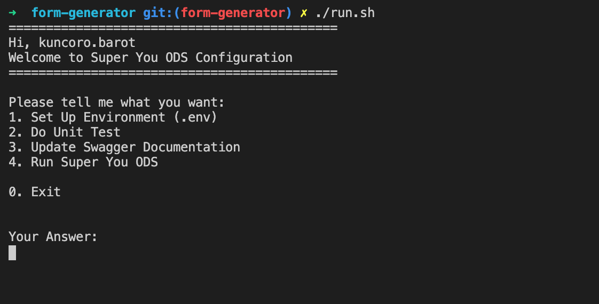
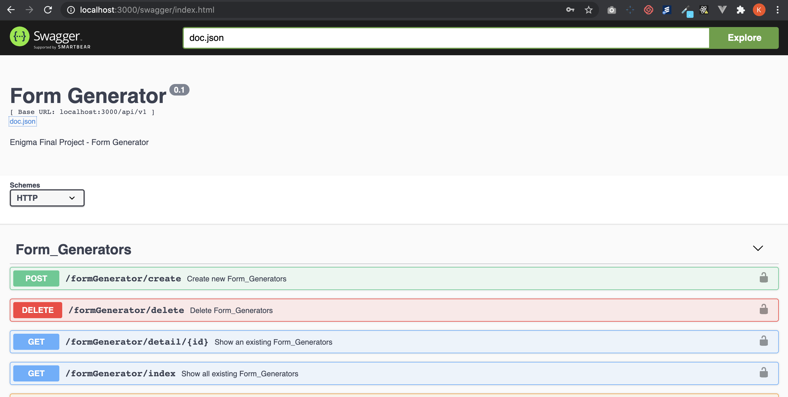
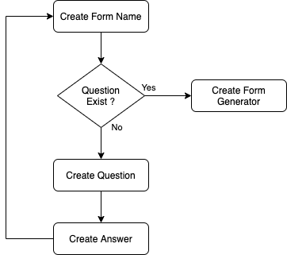

# Form Generator

:bulb: By using this app, I hope that user can create a simple dynamic form based on their needs. 
> Please read [how the app work section](#mag-how-the-app-works-) for overall flow.

### App Information
This app use [gin](https://github.com/gin-gonic/gin) as a framework and [gorm](https://gorm.io/index.html) as an ORM.

# :page_facing_up: Installation

1. Go installation: 
- Download: https://golang.org/dl/
- Instruction: https://golang.org/doc/install#install

2. You need to have database and set it later in .env:
```
Create your own form-generator database, lets call it `enigmaschool`
```

## Install Swagger Library
```bash
go get -u github.com/swaggo/swag/cmd/swag
```

## Easy Setup & Run Form Generator
For make it easier to do configuration in Form Generator, I create shell script that you can use by type:
```bash
./run.sh
```

> If you need to run manual, please see [manual handling section](#wheelchair-manual-handling)



You need to use this step-by-step for running the app at the first time:
```go
1. Set Up Environment (.env) 
// Used for set-up app environment. For the first setup, you need to change your environment detail. For more information about environment that you need to add, please contact developer.

2. Do Unit Test 
// You can always running unit test by this feature

3. Update Swagger Documentation 
// You use swagger for maintain API restful documentation. You can check it later after running app (4. Run Form Generator) and redirect to your app_link/swagger/index.html

4. Run Form Generator 
// This feature is used for running the app
```

## API Documentation
> This feature only can be used after running the app
```bash
redirect to this link --> /swagger/index.html
```
e.g. http://localhost:3000/swagger/index.html



---

# :mag: How The App Works ?



---

# :wheelchair: Manual Handling

## Set Environment
```bash
cp .env.example .env
```
> Fulfill your environment setup

## Unit Test
```
cp .env test/.env
go clean -testcache && cd test && go test -v && cd ..
```

## Update Swagger Documentation
```bash
swag init
```
or
```bash
{GOLANG_PATH}/go/bin/swag init 
//e.g. /Users/kuncoro.barot/go/bin/swag init
```

## Running App
```bash
go run main.go
```

